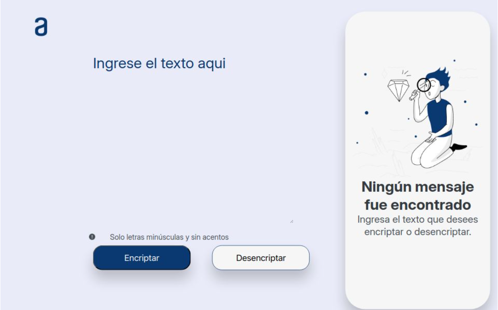

# Encriptador de Texto - ALURA Challenge 1
 

Este es un proyecto desarrollado como parte del Challenge 1 de ALURA LATAM. El objetivo es crear una aplicación web que permita encriptar y desencriptar mensajes de texto siguiendo una lógica específica. 

## Características

- **Encriptar texto:** Convierte las vocales en cadenas de texto predefinidas. Según las siguientes reglas:
    * e -> enter
    * i -> imes
    * a -> ai
    * o -> ober
    * u -> ufat
- **Desencriptar texto:** Revierte el proceso de encriptado.
- **Copiar texto:** Permite copiar el texto encriptado/desencriptado al portapapeles.
- **Validación:** Solo acepta letras minúsculas y sin acentos.

## Tecnologías Utilizadas

- **HTML5:** Para la estructura del sitio.
- **CSS3:** Para el diseño y estilo visual.
- **JavaScript:** Para la lógica de encriptado/desencriptado y la interacción con el usuario.

## Estructura del Proyecto

- `encriptadorfigma.html`: Archivo HTML que contiene la estructura de la página web.
- `logigencriptador.js`: Archivo JavaScript que maneja la lógica de encriptado, desencriptado, y copiado de texto.
- `encriptador.css`: Archivo CSS (en la carpeta `style/`) que define los estilos y el diseño visual de la aplicación.

## Instrucciones de Uso

1. **Encriptar un mensaje:**
   - Escribe el mensaje que deseas encriptar en el área de texto.
   - Haz clic en el botón "Encriptar".
   - El mensaje encriptado aparecerá en la segunda área de texto.

2. **Desencriptar un mensaje:**
   - Escribe el mensaje encriptado en el área de texto.
   - Haz clic en el botón "Desencriptar".
   - El mensaje original aparecerá en la segunda área de texto.

3. **Copiar el mensaje encriptado/desencriptado:**
   - Haz clic en el botón "Copiar" para copiar el texto encriptado o desencriptado al portapapeles.

## Requisitos

- Navegador web moderno que soporte HTML5, CSS3 y JavaScript.

## Demo

## Autor

**Julián Adrián Viana Palomo** - 12/08/2024

## Licencia

Este proyecto se encuentra bajo la licencia MIT. Puedes hacer lo que quieras con el código, siempre y cuando les de un uso adecuado.
